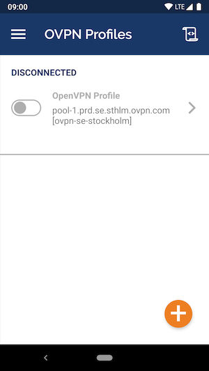
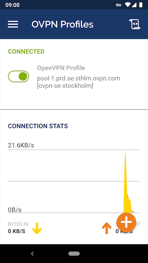

---
## Guide to install OpenVPN client for Android

### **1. Download OpenVPN Connect**

The first thing you need to do in order to connect to CloudLAN Room is to install [OpenVPN Connect for Android](https://play.google.com/store/apps/details?id=net.openvpn.openvpn&hl=en).

### 2**. Open the downloaded configuration file**

Open the configuration file that you downloaded. OpenVPN Connect should start and allow you to import the profile.

Click on OK. Enter generated login credentials when prompted and click on Add in the top right corner when you're done.

### 3**. Connect to CloudLAN**

- Connect by clicking on the grey toggle that appears next to the profile name.

- It is possible that you will see a message about chosing certificate. You can discard that message and just click on Continue

### 4**. Finished**

You should now be connected to CloudLAN Room and be able to browse the internet safely & connect to Hosts added to the room.

---
:::info
 ** Got a question not answered in this knowledge base?**  
 Contact us at [cloudlan@simply5.io](mailto:cloudlan@simply5.io) or "chat with support" from our website or inside the app
:::