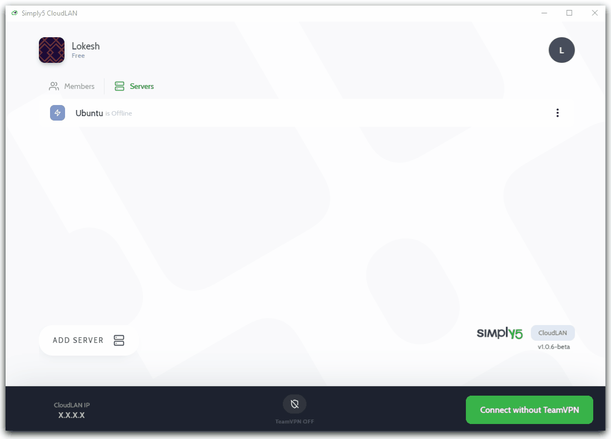

---

## How to Adopt Ubuntu server?
Before adopting a server make sure your resourses meets below prerequisites. 
### Prerequisites
---
- You are the admin of the room
- You are connected to the Room
- Have access to the server you are trying to adopt
- Room has free license to adopt a server
- ---

### Instructions

The below Quick GIF demonstrates how to adopt ***Ubuntu Server*** and ***Service casting*** from servers without exposing its actual IP address using CloudLAN.


- Click on **Add New Server**
- Give it a name & click **Get code**
- Select CentOS from OS dropdown & the relevant installation command is copied to your clip board

```bash
wget https://cdn.simply5.io/cloudlan/apps/clan-server; chmod +x ./clan-server; sudo ./clan-server
```

- Paste the command into server terminal and execute it to install clan-server client
- Copy **One time code** from the CloudLAN App
- Paste **One time code** on your server terminal when server prompts for this one time code. (One time Code will be valid for only 10 minutes, you can regenerate if it expires )
- Client will install necessary driver & connect to CloudLAN room
- Server will be seen online from CloudLAN app and now you can cast services running on Server using **add service** button.

**Quick troubleshoot** : If there are any error at the time of adoption please follow uninstall steps below & try readopting once again by running :   sudo ./clan-server

### Optional commands

Check status of running app

```bash
sudo systemctl status clan
```

Stop Clan-server client & temporarily disconnect from the room 

```bash
sudo systemctl stop clan
```

Start clan-server client & reconnect to the room

```bash
sudo systemctl start clan
```

Check IP adaptors status 

```bash
ifconfig
```

## How to Remove clan-server client in Ubuntu?

- First step is to disconnect room from server side by running below command in the terminal.

```bash
wget https://cdn.simply5.io/cloudlan/apps/uninstall-clan-server.sh[;](https://cdn.simply5.io/cloudlan/apps/unistall-clan-server.sh;) chmod +x ./uninstall-clan-server.sh; sudo ./uninstall-clan-server.sh
```


- Now you can remove the server from you CloudLAN room using remove button.



---

:::info
:information_desk_person: **Have you any question which is not answered in this knowledge base? **
Contact us, We are here to help you. at [hello@simply5.io](mailto:hello@simply5.io) or "chat with support" from our website or inside the app
:::