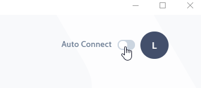

---

import useBaseUrl from '@docusaurus/useBaseUrl';

## Introduction 
Room is a VPN workspace for your team & servers. 
### CloudLAN Free Room
- Every user will receive a Free room on signup which will have a Data cap / month. 
This should be sufficient for trying out CloudLAN for your use case. 

### CloudLAN Paid Room
- Once you are ready, you can subscribe to a paid room by creating a new room for the team.

### Connecting to a CloudLAN Room

    <video className="responsive-iframe" src={useBaseUrl("videos/Connecting_to_room.mp4")} title="Connecting to room" autoPlay="true" controls ></video>

**CloudLAN** is a virtual network that's provisioned for you & your team to connect & collaborate in.  

You have 2 methods of connection to a CloudLAN room, TeamVPN ON or OFF.
### Connect without TeamVPN
"Connect without TeamVPN” (OFF), all your regular internet requests will be sent through your local internet connection. This helps in better latency on VoIP or Web conferencing. Data usage will be counted as **CloudLAN Data.**

### Connect with TeamVPN
“Connect with TeamVPN” (ON), all your internet traffic is securely routed through your CloudLAN room. This is useful when you are using an unknown WIFi network or want to access servers protected by firewall rules to allow only connection from whitelisted IP. Check our article on [securing your cloud resources with TeamVPN](https://docs.simply5.io/tag/secure-you-cloud-resources/). 
Data usage will be counted as **TeamVPN Data.**
### Auto Connect for Windows client

Enable Auto Connect on Windows client to launch the app & connect to the room when your system reboots.

:::info
:information_desk_person: **Something we didn't cover?**
email us at [hello@simply5.io](mailto:hello@simply5.io) or "chat with support" from our website or inside the app
:::