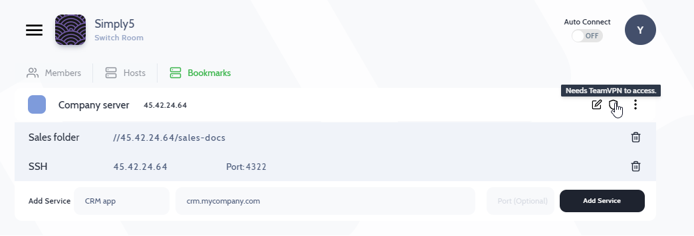

---

Modern Teams work with many web services, keeping track of all the URLs scattered across different chats/emails is challenging. Also, servers that are protected by firewall rules to allow access only from TeamVPN IP of the room needed a simpler place of record, accessible by everyone on the team. 

The Bookmark feature works like a shared URL notepad for your team, you can also add individual services running on each server so links are better organized & everyone can easily access them.

:::note 
- Anyone can add a Bookmarks & links of services running on the server 
:::

## How to add a Bookmark?

In this example, We have a Company server @ 45.42.24.64, which can only be accessible through TeamVPN & hosts 
- CRM application accessible through - crm.mycompany.com
- Windows File service 
- SSH server on port 4322
 

Go to Bookmark tab on the app & click on *Add Bookmark*

### Add running services 
Once a server is added to Bookmark, you can add running services using "Add service"

***Note*** : *The Active shield implies you would need to 'Connect with TeamVPN' to access services running on this server*

 

---

:::info
:information_desk_person: **Got a question not answered in this knowledge base? **  
Contact us at [cloudlan@simply5.io](mailto:cloudlan@simply5.io) or "chat with support" from our website or inside the app
:::