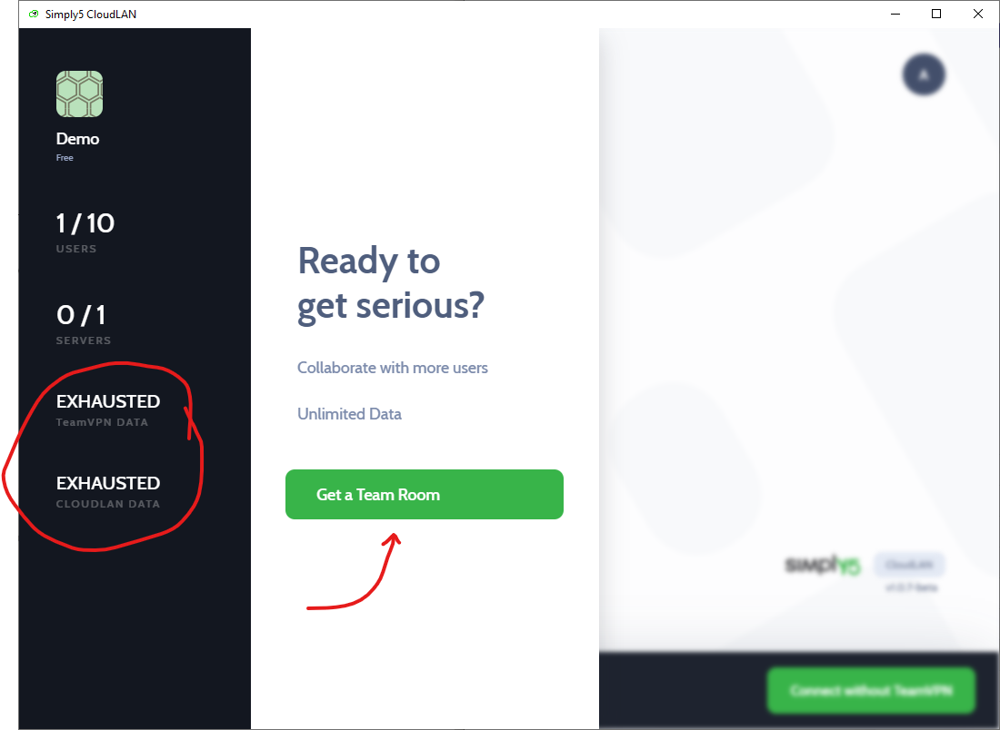

---

import useBaseUrl from '@docusaurus/useBaseUrl';

## Introduction 
CloudLAN Room is Virtual network created for your Team & Servers
### CloudLAN Free Room
- Every user will receive a Free room on signup which will have a auto-renewing Data cap / month.  
This full featured room should be sufficient for trying out CloudLAN with your team

### CloudLAN Paid Room
- Once you are ready, you can subscribe to a paid room by creating a new room for the team.

### Connecting to a CloudLAN Room

    <video className="responsive-iframe" src={useBaseUrl("videos/Connecting_to_room.mp4")} title="Connecting to room" autoPlay="true" controls ></video>

 

You have 2 methods of connection to a CloudLAN room, TeamVPN ON or OFF.
### Connect without TeamVPN
"Connect without TeamVPN” (TeamVPN OFF), all your regular internet requests will be sent through your local internet connection. Use this when you are connected to a trusted WiFi network or you dont need to access any services only accessible through TeamVPN. This helps in better latency on VoIP or Web conferencing.     

### Connect with TeamVPN
“Connect with TeamVPN” (TeamVPN ON), all your internet traffic is securely routed through your CloudLAN room. This is useful when you are using an unknown WIFi network or want to access servers protected by firewall rules to allow only connection from whitelisted TeamVPN IP.   Check our article on [securing your cloud resources with TeamVPN](https://docs.simply5.io/tag/secure-you-cloud-resources/).    

### Auto Connect 

Enable Auto Connect to launch the app & connect to the room when your system bootsup 

---
:::info
:information_desk_person: **Got a question not answered in this knowledge base? **  
Contact us at [cloudlan@simply5.io](mailto:cloudlan@simply5.io) or "chat with support" from our website or inside the app
:::