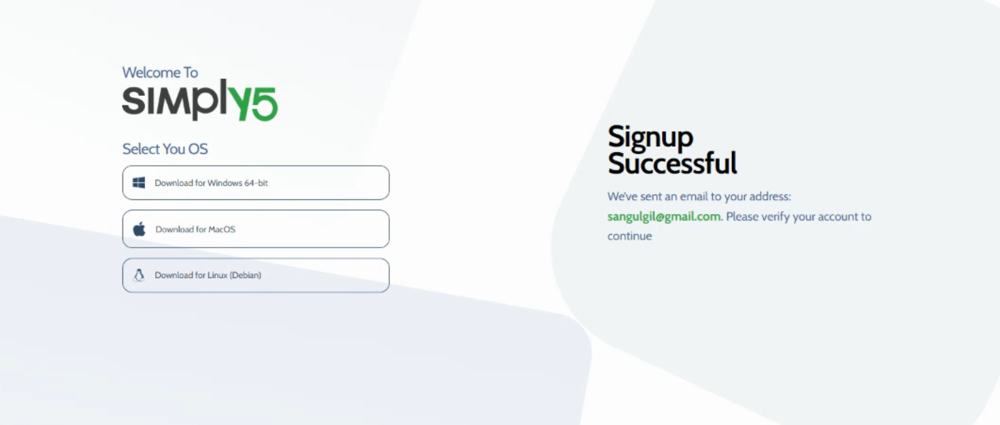
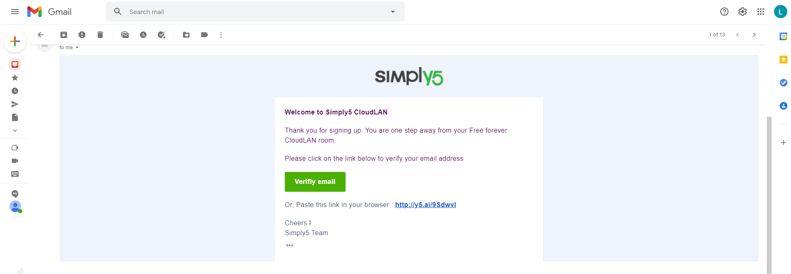
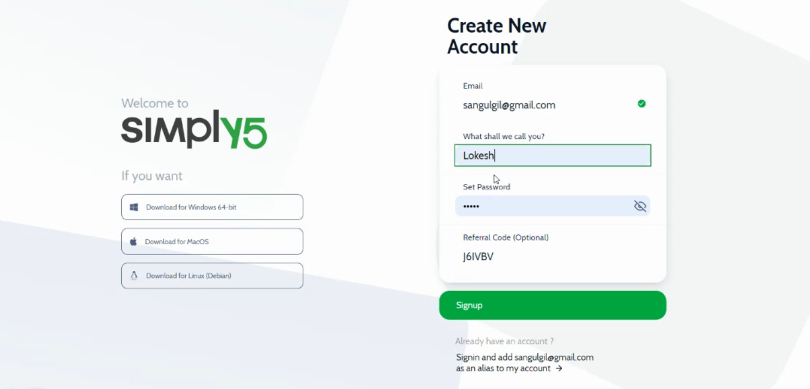
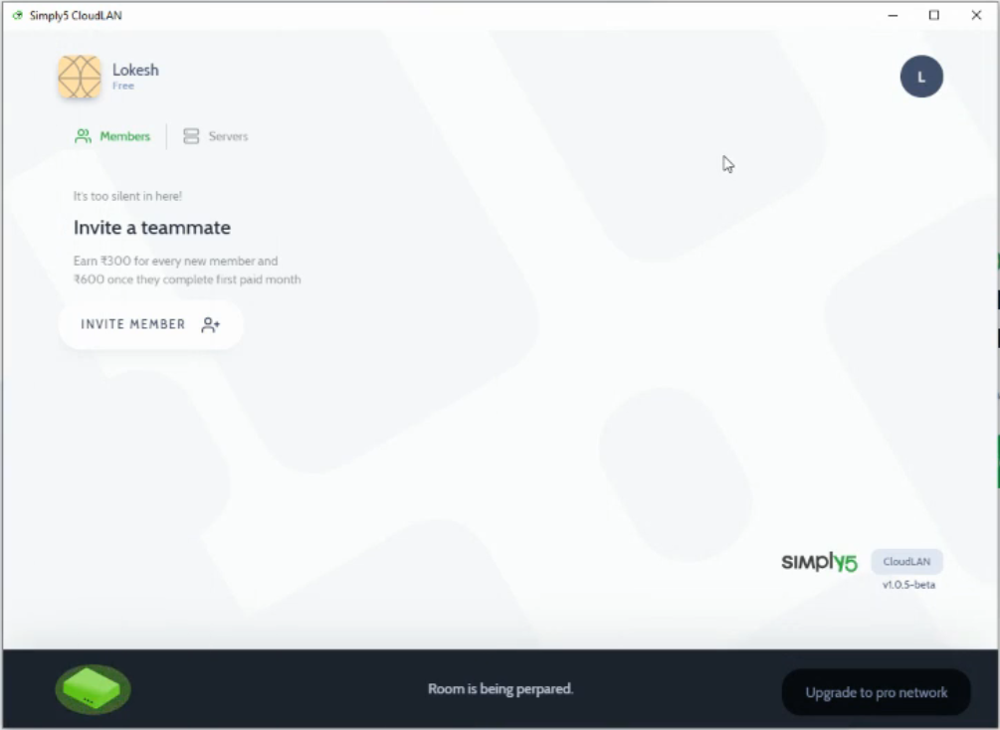
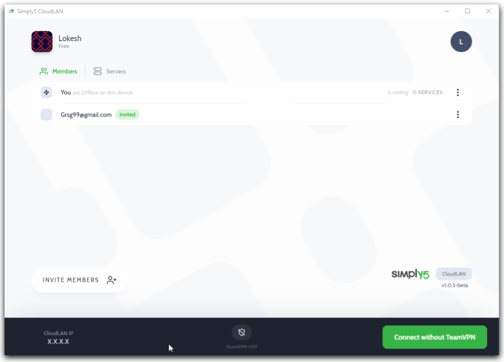
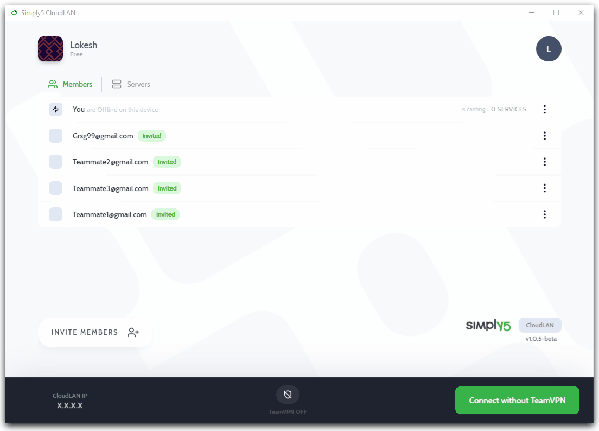
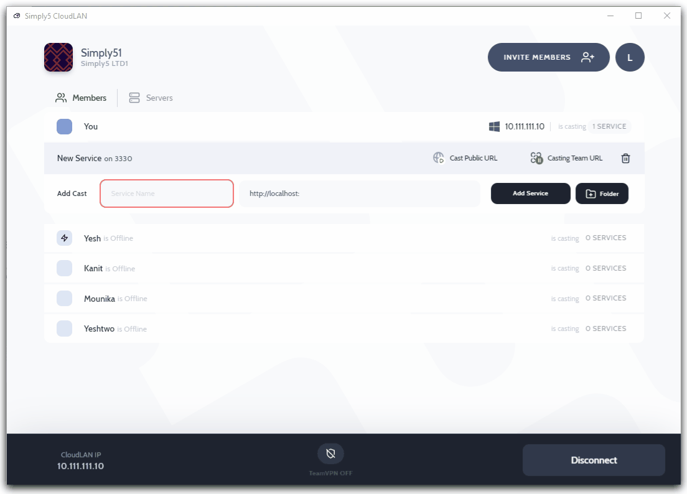

<!-- # Get started -->

Hi there 👋 Welcome to CloudLAN, the virtual LAN network for your distributed teams. We are focused on providing the necessary toolset to quickly enable your team to work together even when you are apart. 

This software is built for remote teams to avoid security issues. It allows your teams to access the distributed files more securely than ever.

When your team can consume latest changes/feature updates of the code in **Realtime**, why to wait for git push and deployments? 

Install **Simply5 CloudLAN** and Say Goodbye to remote development Inefficiencies.

| **Name**            | Tags                                                                        |
| ------------------- | --------------------------------------------------------------------------- |
| **Room**            | "Work space where your team & devices connect "                             |
| **CloudLAN IP**     | Private IP for each connected user/server                                   |
| **TeamVPN IP**      | Common internet Static IP for your team to browse the internet              |
| **Servers**         | A client app to connect always-on devices/VM’s to the room over CloudLAN IP |
| **TeamVPN ON/OFF**  | Connect options to your room                                                |
| **Add service**     | "adding a service / server running on your system to CloudLAN "             |
| **Add folder**      | Adding a folder to CloudLAN                                                 |
| **Service Casting** | Ability to host the service for your team or public internet                |
| **TeamURL**         | Only users connected to same room will be able to access                    |
| **PublicURL**       | Anyone with the link will be able to access                                 |

## 🤔 How to setup a CloudLAN Room?

> [Download](https://www.simply5.io/download/)→[Signup](https://www.simply5.io/download)→Installs→Login→Connect→Invite

By default you will get a free version of CloudLAN Room. In that, you can use all the features for free.

Get onboard & try out CloudLAN without any hassle.

## How to setup CloudLAN room for free?

`*` **  [Windows 64](../client_apps/cloudlan_for_windows.md) ** 

`*` **  [MacOS](../client_apps/cloudlan_for_macos.md) ** 

`*` **  [Linux](../client_apps/cloudlan_for_linux.md) **

### Signup your CloudLAN Account
`1.` Enter your email address and click on **signup** button.

   

  

`2.` Verification link will be sent to your inbox, Please verify your email address by clicking on the received link.

 

 Email verify link sent → wait for the verification link to receive in your mail inbox

`3.` Received verification link and continue to signup process by clicking on the verify email button.

 Yey...! Received verify email→ Continue to signup process by clicking ***verify email***.

`4.` Create your account by filling up the signup form.

 

  Enter your name and password to create an account on `Simply5 CloudLAN`

:::tip
  Enter the referral code if you referred by someone. To know more about referral benefits [check here](../features/referrel_program.md)  
:::

`5.` Now account is ready, if you have installed the app use with **launch application** to autologin

 

`Launch Application` → Now you can login to the app using launch application button, if you not installed app already Please download and install the app first, then click on launch application button.

`6.` Your **Free Room** is being prepared in the background and you need to wait for a minute to get it ready to connect.

 

## Invite & Join Room

- It's time to invite your team members to your room.

    

- Use **invite member** to invite teammates by adding their email addresses.

    

- Invite more members at a time.
 
  - You can invite more members at a time by entering their email addresse

- As a bonus you earn credits for each new users invited to CloudLAN.

    

- New teammates can join room by signing up with invitation mail or accept the invite from the app's **Rooms draw**
  

## User Rooms List

By clicking on room icon user room list will be viewed.

- Switch to different rooms by selecting room from room list.

    

## Service casting

- Once you connected to room, you can cast your [localhost](http://localhost) services among your teams.

    

## Share your folders/any files to your teammates

- Add Service name and port, then select folder you want to share with teammates.

    
  

---

:::info
:information_desk_person: **Have you any question which is not answered in this knowledge base? **
Contact us, We are here to help you. at [hello@simply5.io](mailto:hello@simply5.io) or "chat with support" from our website or inside the app
:::
