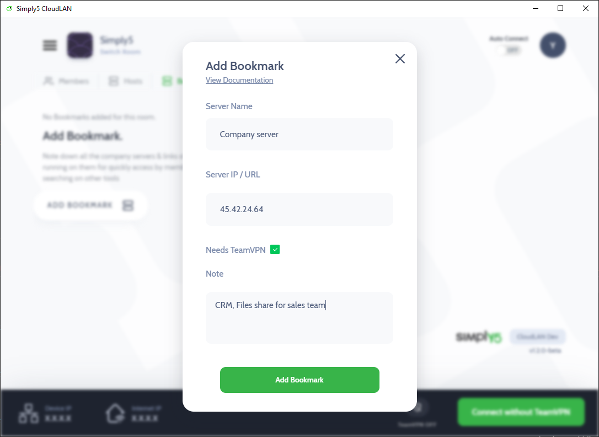
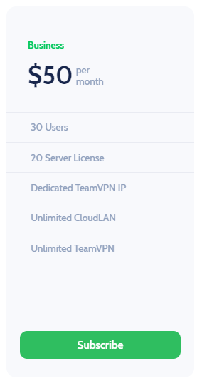
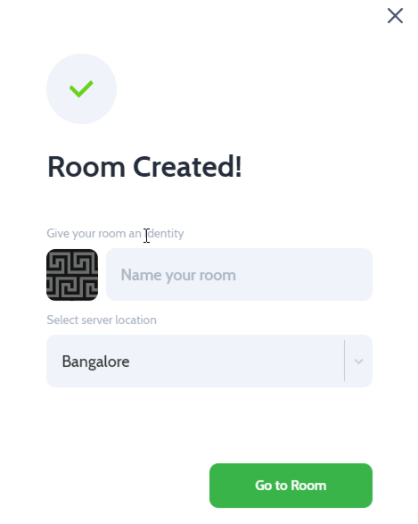
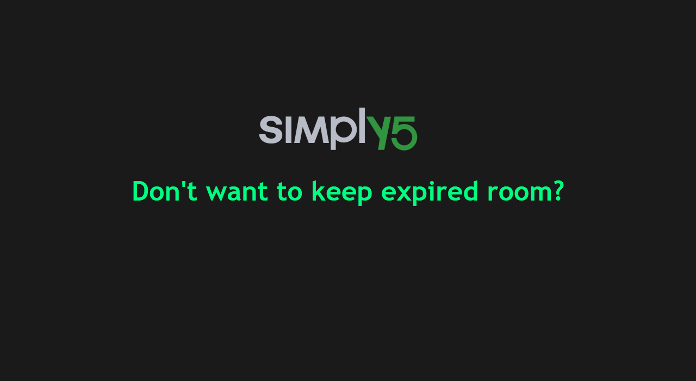

---

import useBaseUrl from '@docusaurus/useBaseUrl'; 

## **v1.3 -  July 30, 2021 | Security  🔐**
---
### 1. New Solo Plan 🎉
   The solo plan offers the same excellent level of service and quality as our regular plans, just at a more affordable rate. 

    

          
    

 

### 2. Stronger Encryption

 Advanced Password Encryption is activated, making your password virtually unbreakable. Reset your password to protect your account with advanced stronger encryption.
 
 

### 3. Two-Factor-Authentication

 

      

    

 

 This is an extra security layer to help secure your account. You can enable 2FA from "Security" tab in your CloudLAN account panel. Make sure you have Authy or Google Authenticator app installed on your phone.

### 4. Offline Payment Options

Now subscribe to CloudLAN through WireTransfer & other offline payment methods. Contact support to process the order. Available only for annual plan subscriptions.

### 5. Affiliate Program

We are excited to introduce an affiliate program for CloudLAN. If you are a IT consultant & like CloudLAN service and think your customers will too, feel free to promote it. And if users sign up through your link, you’ll earn a recurring commission upto 25% each month. Click here to apply for Affiliate program 

### 6. Integration Guides Launch

Now it's super easy to integrate your business systems with CloudLAN. Ensure your security by whitelisting IPs from accessing resources. Email us if your business system is not listed here.

### 7. Other Enhancements ⚙

- **Transfer Account Ownership** - By changing the default email of the user account, ownership of company CloudLAN rooms can be trasnfered to new team member easily.
- **Auto-Connect** - We have improved the background connection process to app recovers from fluctuations in internet connectivity.
  

---

## **v1.2 -  June 12, 2021**
---

### 1. Host adoption from desktop clients

    <video className="responsive-iframe" src={useBaseUrl("videos/how_to_add_host_and_adopt_windows.mp4")} title="Connecting to room" autoPlay={true} controls ></video>

  

Now you can use CloudLAN desktop clients to connect non-personal devices using an integrated [Host-agent app](./hosts_intro.md). Super simple onboarding for Windows & Mac machines so all the members can securely access the device remotely over CloudLAN Device IP

### 2. Briefcase for all your links

[Bookmark](./bookmark.md) your servers and important links, making them centrally accessible by all members of CloudLAN room. No more digging through chats & email for the latest link of application in deployments.

### 3. New Raspberry Pi Host agent

[Connect Raspberry Pi](../installation_guide/cloudlan_hosts/host_agent_raspbian.md) board to your CloudLAN room in 2 commands, Access your project from anywhere

    <video className="responsive-iframe" src={useBaseUrl("videos/howtoRPI.mp4")} title="Connecting to room" autoPlay={true} controls ></video>

GIF demonstrates adopting a Raspberry Pi host to CloudLAN room

### 4. Now Save more with Yearly plans
Check out the new plans & start saving more with annual subscription.
### 5. Other Enhancements ⚙ 

#### 1. OpenVPN client Support

[Generic Client](../getting_started/generic_client.md) support lets you use any OpenVPN protocol supporting client for connecting [Users](../installation_guide/client_apps/user_generic_client.md) & [Hosts](../installation_guide/cloudlan_hosts/host_with_generic_client.md) to your CloudLAN room.

#### 2. Static PublicURL

CloudLAN's PublicURL will remain the same through start/stop casting till the service is removed. This is helpful when using PublicURL in dev environment or as webhook endpoint.

#### 3. UX improvement

Following the feedback users, we have made some visual improvement & added help texts to onboard new users much faster without digging into documentation. 

#### 4. Documentation

We have rewritten the [documentation](http://wiki.simply5.io) to make it friendly for non-technical users. Drop-in your suggestions @ cloudlan@simply5.io

---

## ** v1.1 - Mar 12, 2021** 
---

*Since our first launch, many subscribers were requresting for a Dedicated IP for their Rooms. We are sure that this feature will make CloudLAN more personal & secure.*

*With CloudLAN v1.1 release, subscribers will now be able to achieve more security & flexibility, can connect to their virtual office/CloudLAN Room from any device that supports OpenVPN Client, with improved Hosts adding experience and many more.*

Simply5 CloudLAN Introducing new features and enhancements to make a powerful tool for remote teams.

**With our most recent updates, you can:**

----
### 1. Now connect any device that supports generic OpenVPN Client with improved Host adding experience

---
### 2. Get dedicated IP to work faster & secure

---

### 3. New regions - London, Singapore & Los Angeles

---
### 4. Enable 'Auto Connect' to connect instantly on system bootup

---

### 5. Don't want to keep expired paid room anymore?* Delete it from your profile

---
### 6. Easy access to TeamVPN IP from Rooms panel.

---

