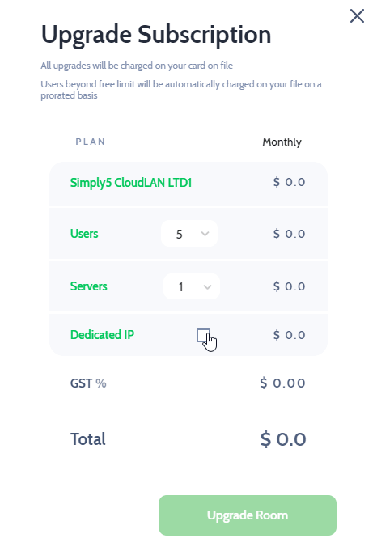

# Mar 12, 2021
---

Simply5 CloudLAN Now Introducing Server Feature in this update.

*Since our first launch, many of our subscribers were demanding for a Dedicated IP to their Rooms and we understood the importance of secure connections across platforms. We are sure that this feature will make our customers more secure on cloud room.*

*With this cloudLAN v1.1.0 release, subscribers will now be able to achieve more security & flexibility in the network & can connect to their virtual office/CloudLAN Room from any device that supports OpenVPN Client, with improved server adding experience and many more.*

### Application updated to v1.1.0

Simply5 CloudLAN Introducing new features and enhancements to make a powerful tool for remote with it’s release of v1.1.0.

## With our most recent updates, you can:
----
### 1. *Now connect to the room using any device that supports OpenVPN Client on it with improved server adding experience.*

---
### 2. *Get dedicated IP to work faster & secure*

---
### 3. *Get Dedicated IP address as addon if you are an LTD subscriber.*

---

### 4. *Create a room with a new server region *(LONDON)*.*

---
### 5. *Enable **Auto Connect** on our GUI to connect instantly on app start.*

---

### 6. *Don't want to keep expired paid room anymore?* Delete it from your profile.

---
### 7. *View TeamVPN IP on the Rooms panel.*

---

