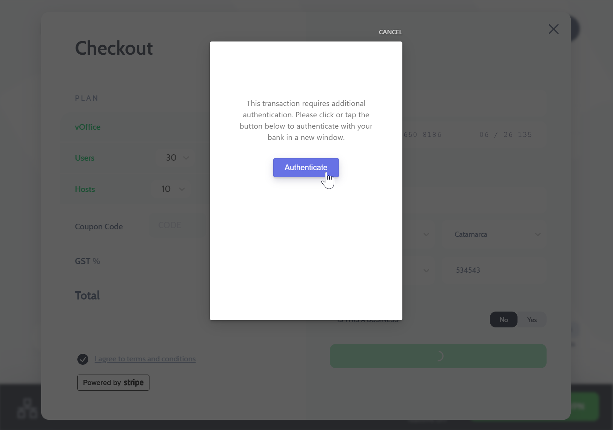

---
import useBaseUrl from '@docusaurus/useBaseUrl';

### My Free room is expired, How to re-activate it?
Free room gets expired if it is not used regularly. You can revive it by visiting the room from the app & initiating "Re-subscribe".

    <video className="responsive-iframe" src={useBaseUrl("videos/howtoresubscribe.mp4")} title="How to Subscribe" autoPlay="true" controls></video>

---

### Do I need a credit/debit card for free room subscription?

No, Free room is allocated to you on first app login, without any payment details required.

---
### What are the payment methods I can use to subscribe?

We use Stripe to process our payments, You can use all types of credit cards to subscribe to CloudLAN.

---

### I am getting error at 2FA step while creating a new subscription?

 Cards from some issuing banks are not completely integrated with Stripe 2FA authentication flow, so you may see the following message & transaction will fail when trying to subscribe from the app.

 

In this case, you will need to first [**Add a card through the Billing section**](http://y5.ai/usercards) on your account profile page.  
Once added, you can subscribe to CloudLAN room from the app using the added card.

---
### Are my card details safe with Simply5 CloudLAN?

Yes, We use Stripe - a PCI-certified payment gateway to handle your payment data. Simply5 doesn't hold your card details at any point of the transaction as they are submitted to Stripe directly.

---

### Who can use CloudLAN?

Anyone can subscribe to a CloudLAN room by downloading the app & creating a new room. Once created, admin can invite other users so they can connect to it.

---
### When can I redeemed my Referral credits?

Once redeemed from your referral tab, the credits are transferred to your Simply5 Wallet, These credits are automatically used at the time of your next subscription renewal.

---
:::info
 ** Got a question not answered in this knowledge base?**  
 Contact us at [cloudlan@simply5.io](mailto:cloudlan@simply5.io) or "chat with support" from our website or inside the app
:::