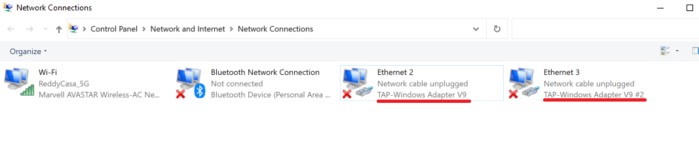

---

import useBaseUrl from '@docusaurus/useBaseUrl';

## Close CloudLAN Appp
- As the CloudLAN app runs as service, app minimizes to taskbar when you click ❌button.
- To properly close the app, go to taskbar or system tray & right-click on the icon & 'quit'

### For windows

    <video className="responsive-iframe" src={useBaseUrl("videos/How_to_close_the_app.mp4")} title="How to close the app" autoPlay="true" controls></video>

## 🛠 Troubleshooting connection issues

 

- Check if reinstalling helps

    When running the installer, try running as Administrator 

    

    Make sure you have accepted this driver install prompt 

    

- Check if TAP adaptor is installed
    #### On Windows

 > Windows + R >

 > type **ncpa.cpl** & click "OK"

  > Make sure at least 1 TAP-WIndows Adapter is available

    
 ### If TAP-Windows Adapter is not installed, 
 - Download & install [OPENVPN GUI client](https://openvpn.net/community-downloads/)
 - Re-Check if the adaptor is installed.
 - Now try connecting to CloudLAN

---
:::info
:information_desk_person: **Have you any question which is not answered in this knowledge base? **
Contact us, We are here to help you. at [hello@simply5.io](mailto:hello@simply5.io) or "chat with support" from our website or inside the app
:::