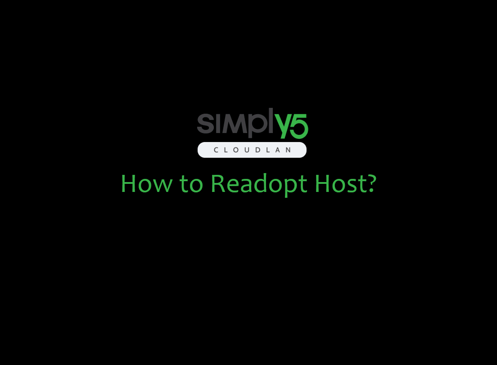

---

import useBaseUrl from '@docusaurus/useBaseUrl';

Host Agent is integrated into CloudLAN Desktop clients. Go to [simply5.io/download](https://www.simply5.io/download) & download the Windows Desktop app. 

:::note Prerequisite
- You are the admin of the room
- You are connected to the Room
- Have access to the host you are trying to adopt
- Room has free host license
:::

### Instructions

The below GIF demonstrates how to adopt ***Windows machine*** 

    <video className="responsive-iframe" src={useBaseUrl("videos/how_to_add_host_and_adopt_windows.mp4")} title="Connecting to room" autoPlay="true" controls ></video>

- Install the Windows Client on Host machine
- On your personal device, Go to ***Host*** tab on CloudLAN app
- Click on **Add host**
- Give it a name, Select ***Host agent*** & click **Continue**
- Select Windows from OS dropdown 
- Copy **Adoption code** from the CloudLAN App
- On the Host machine's CloudLAN app login screen, click on "Adopt as a Host" 
- Type the **Adoption code** & click "Adopt"   (Auth Code will be valid for only 10 minutes, you can regenerate if it expires )
- Agent will install necessary drivers & connect the machine to CloudLAN room
- Machine will be seen online from CloudLAN app and now you can add running on Server using **add service** button

 

CloudLAN app will automatically bootup one system reboot & connect to the room.

## How to Readopt Host

- Select a host and click on ***Re-adopt*** host option.
- A New Auth code for host re-adoption will be displayed 
- Copy new auth code 
- Enter new auth code in the host client app to adopt the host.
- Once the Auth code is validated the client will be connected.

Below Quick GIF Demonstrates how to Re-adopt a host.

---

:::info
 ** Got a question not answered in this knowledge base?**  
 Contact us at [cloudlan@simply5.io](mailto:cloudlan@simply5.io) or "chat with support" from our website or inside the app
:::