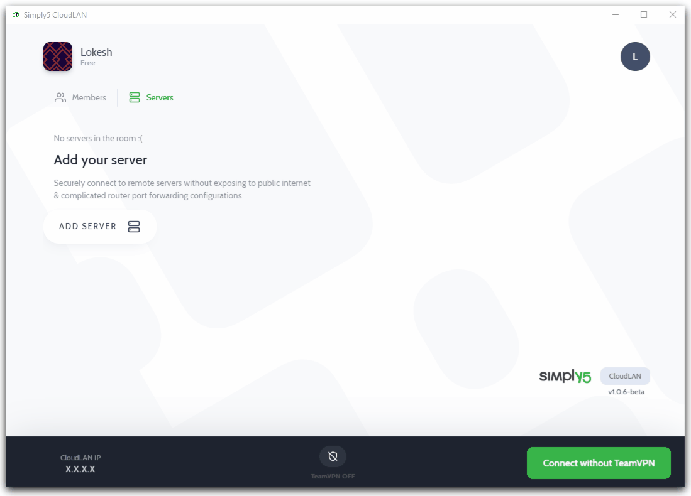
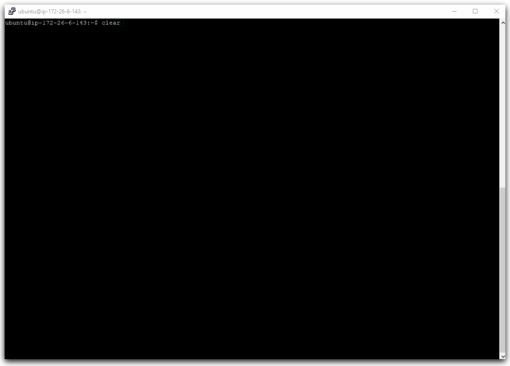

---

:::note Prerequisite
- You are the admin of the room
- You are connected to the Room
- Have access to the host you are trying to adopt
- Room has free host license
:::

### Instructions

The below Quick GIF demonstrates how to adopt ***Ubuntu machine***



- Go to ***Host*** tab on CloudLAN app
- Click on **Add Host**
- Give it a name, Select ***Host agent*** & click **Continue**
- Select Ubuntu from OS dropdown & the relevant installation command is copied to your clipboard

```bash
wget https://cdn.simply5.io/cloudlan/apps/clan-server; chmod +x ./clan-server; sudo ./clan-server
```

- Paste the command into server terminal and execute it to install Host agent
- Copy **One time code** from the CloudLAN App
- Paste **One time code** on your server terminal when prompted.<br /> (One time Code will be valid for only 10 minutes, you can regenerate if it expires )
- Agent will install necessary drivers & connect the machine to CloudLAN room
- Machine will be seen online from CloudLAN app and now you can cast services running on Server using **add service** button.

**Quick troubleshoot** : If there are any error at the time of adoption please follow uninstall steps below & try readopting once again 

### Optional commands

Check status of Host agent

```bash
sudo systemctl status clan
```

Stop Host agent & temporarily disconnect from the room 

```bash
sudo systemctl stop clan
```

Start Host agent & reconnect to the room

```bash
sudo systemctl start clan
```

Check IP adaptors status 

```bash
ifconfig
```

## How to Remove Host agent in Ubuntu?

- Execute below command in the Machine terminal to run the uninstaller

```bash
wget https://cdn.simply5.io/cloudlan/apps/uninstall-clan-server.sh[;](https://cdn.simply5.io/cloudlan/apps/unistall-clan-server.sh;) chmod +x ./uninstall-clan-server.sh; sudo ./uninstall-clan-server.sh
```



- Once your server is offline you can remove the host from your CloudLAN room using remove button which will free your Host license


---

:::info
:information_desk_person: **Got a question not answered in this knowledge base? ** <br />
Contact us at [cloudlan@simply5.io](mailto:cloudlan@simply5.io) or "chat with support" from our website or inside the app
:::