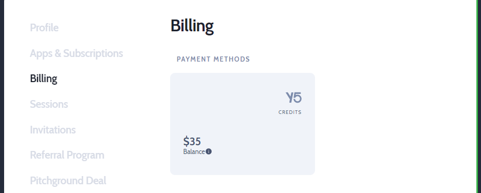

---

import useBaseUrl from '@docusaurus/useBaseUrl';

## Earn referrel credits
Access your referral program stats @ [https://accounts.simply5.io/account?page=referral](https://accounts.simply5.io/account?page=referral)

**CloudLAN** offers an easy way to earn referral credits introducing new users to CloudLAN

1. Inviting users to your rooms
2. Sharing your personal referral link for users to signup with 

You get **$5** for every successful signup & **$10** when the invited user completes first paid month.

Your friends will also get a **$10** credit when they signup with your referral.

- You can check your credits from the profile icon on the app Or by visiting [Referral program](https://accounts.simply5.io/account?page=referral) section in accounts settings 
- Click on **Earn Credits** to see your personal referral link from the app.

## Redeem your earnt Credits
Once you have enough credits, go to  [Referral program](https://accounts.simply5.io/account?page=referral) section & click **Redeem** to transfer them to CloudLAN Wallet so they can be used on next subscription renewal.

You can view the Wallet balance by going into **Billing** section 

---
:::info
:information_desk_person: **Got a question not answered in this knowledge base? **  
Contact us at [cloudlan@simply5.io](mailto:cloudlan@simply5.io) or "chat with support" from our website or inside the app
:::